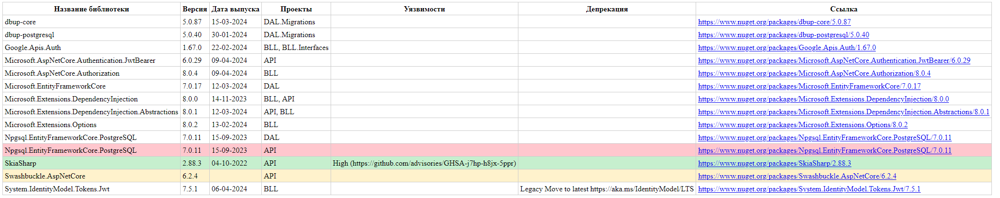

# LibrariesComparer

**LibrariesComparer** is a .NET 8 console application for analyzing project dependencies (NuGet and local DLLs), comparing with previous snapshots, and generating reports (JSON, Excel, HTML).



## Features

- Recursively searches for all `.csproj` files in the specified directory.
- Extracts NuGet packages (`PackageReference`) and local DLLs (`Reference`).
- Retrieves information about versions, release dates, vulnerabilities, deprecates.
- Compares with the previous snapshot:
  - New libraries - green color.
  - Changed versions - yellow color.
  - Removed libraries - red color.
  - Unchanged - white color.

## Example usage

```sh
dotnet run "dirpath"
```

After execution, the `snapshot` folder will contain:
   - `yyyy_MM_dd_HH-mm.json` - the current dependencies snapshot
   - `.html`, `.xlsx` - comparison reports with the previous version
